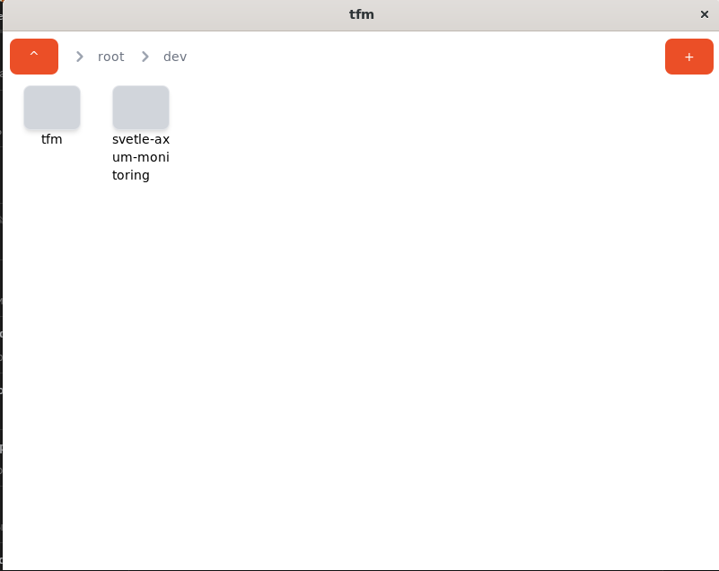

# tfm - stands for terrible file manager

It's simple file manager implementation written with Rust/Tauri and SvelteKit

tfm supports multi-selection, deleting files, creating files & folders, copiyng.
However it's still being buggy